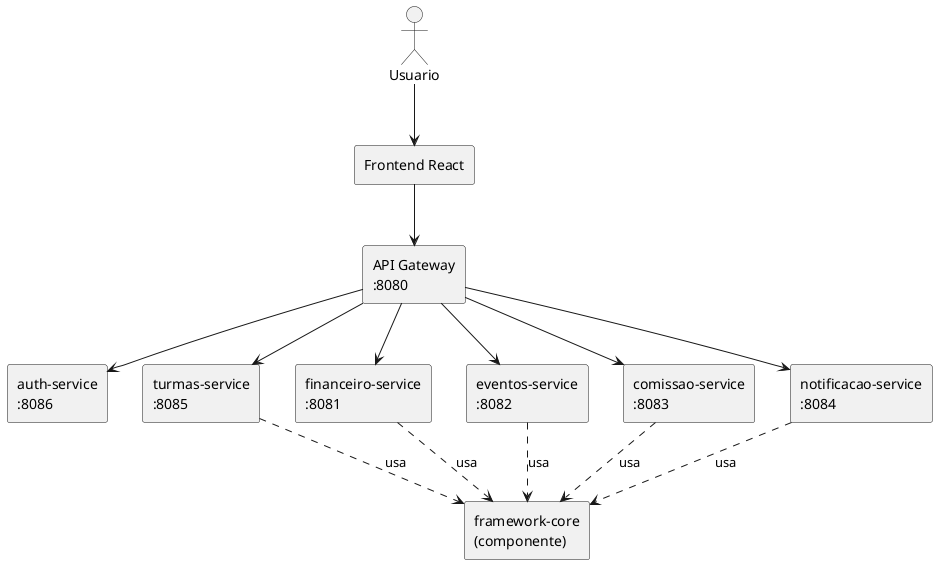
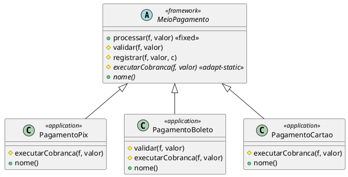
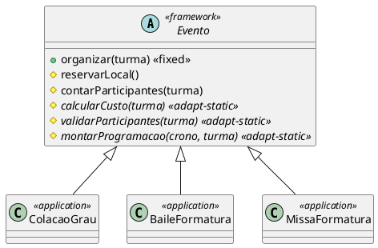
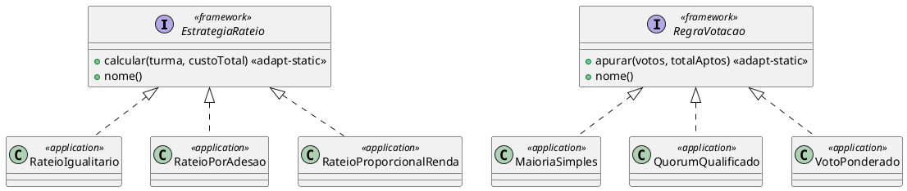
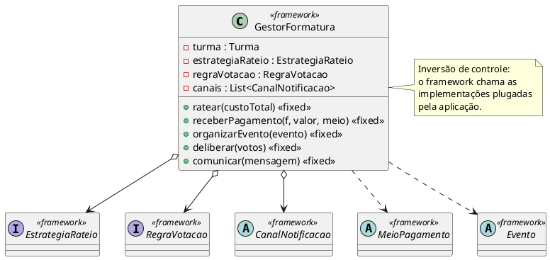

# Diagramas UML-F

Notação UML-F (Fontoura, Pree, Rumpe) — estereótipos:
- `<<framework>>` classe/operação que pertence ao framework
- `<<application>>` classe fornecida pela aplicação (parte variante)
- `<< adapt-static >>` operação adaptada por herança/sobrescrita (hot spot)
- `<< fixed >>` operação fixa (frozen spot / template method)

Os blocos abaixo estão em PlantUML — cole em <https://www.plantuml.com/plantuml>
para renderizar (ou use a extensão PlantUML do VS Code) e exporte como imagem
para o relatório final.

---

## 1. Diagrama de Componentes (Microserviços)

## 2. Hot Spot 2 — `MeioPagamento` (Template Method / caixa-branca)

## 3. Hot Spot 3 — `Evento` (Template Method)

## 4. Hot Spot 1 e 4 — `EstrategiaRateio` / `RegraVotacao` (Strategy / caixa-preta)

## 5. Parte invariante — `GestorFormatura` (caixa-preta / composição)

